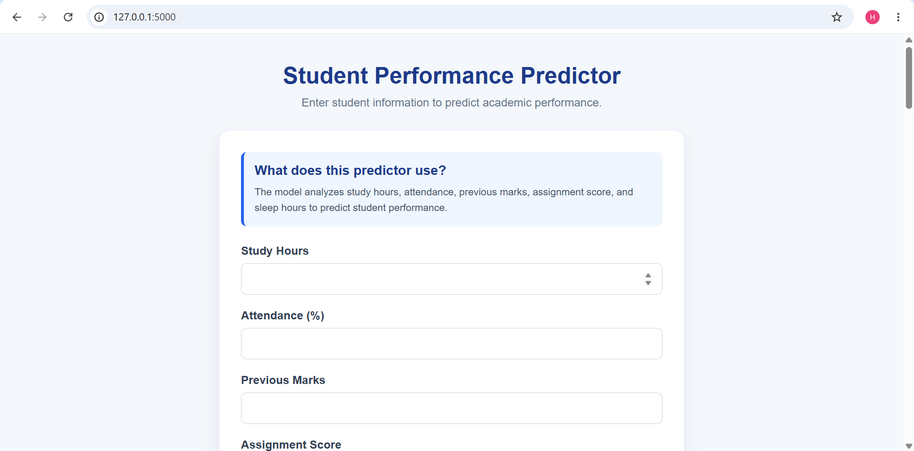
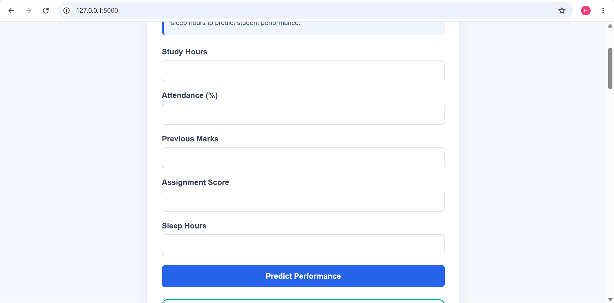
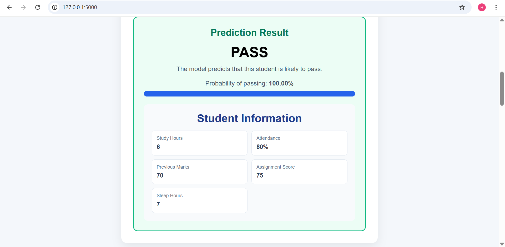
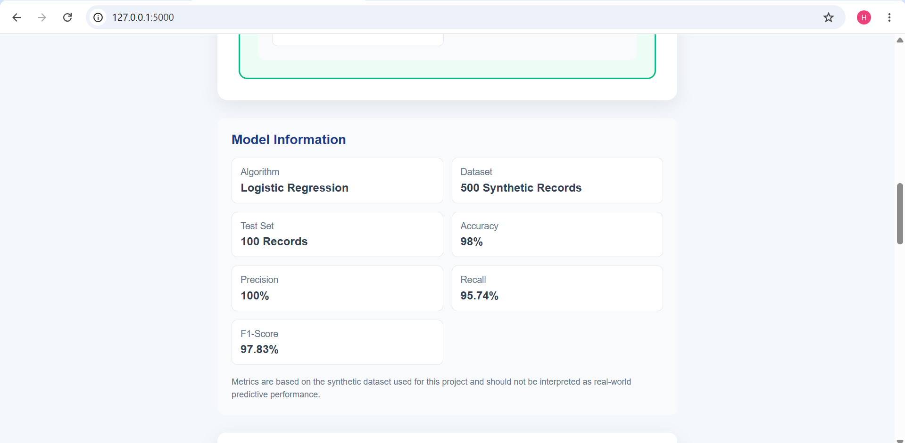
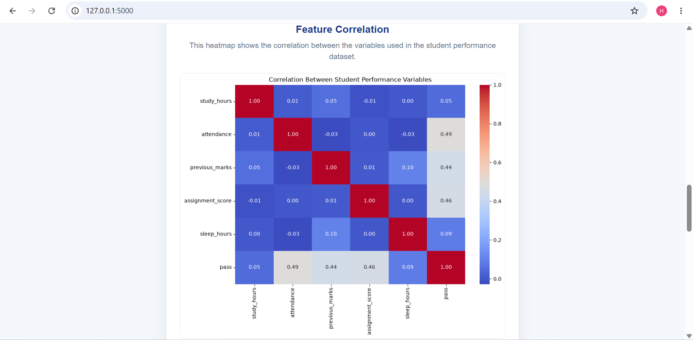
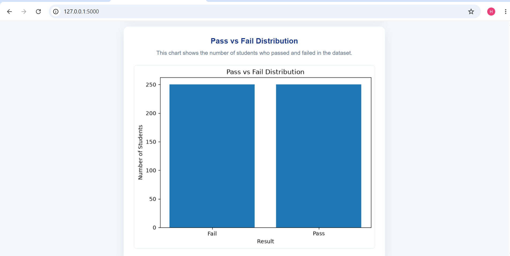
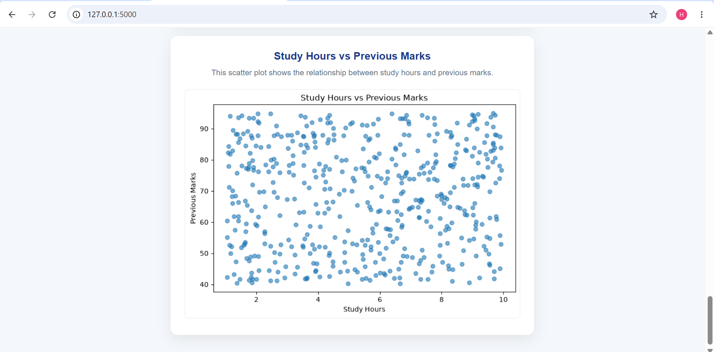
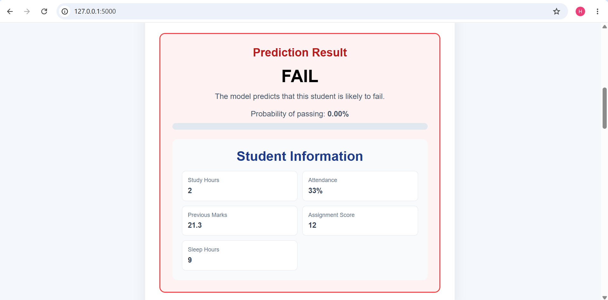

# Student Performance Predictor

A beginner-friendly machine learning project that predicts whether a student is likely to **pass or fail** based on academic and lifestyle-related factors.

## Live Demo

Try the deployed application here:

[Student Performance Predictor - Live Demo](https://student-performance-predictor-78btjjhsnc7hhfsvm3qm6t.streamlit.app/)

## Project Overview

The Student Performance Predictor uses a **Logistic Regression** machine learning model to perform binary classification.

The model uses the following student-related features:

* Study Hours
* Attendance
* Previous Marks
* Assignment Score
* Sleep Hours

The prediction target is:

* `0` → Fail
* `1` → Pass

The trained machine learning model is integrated into a **Flask web application**, allowing users to enter student information through a web form and receive a PASS/FAIL prediction.

## Features

* Student performance prediction
* Logistic Regression classification
* Data exploration using Pandas
* Data visualization using Matplotlib and Seaborn
* Model evaluation using multiple metrics
* Interactive Flask web interface
* Prediction probability display
* Student input summary
* Correlation heatmap
* Pass vs Fail distribution chart
* Study Hours vs Previous Marks visualization

## Technologies Used

* Python
* Pandas
* NumPy
* Matplotlib
* Seaborn
* Scikit-learn
* Flask
* Joblib
* HTML
* CSS

## Machine Learning Workflow

The project follows a basic machine learning workflow:

1. Generate and prepare the dataset
2. Explore the dataset
3. Analyze the data
4. Visualize relationships between variables
5. Split the dataset into training and testing sets
6. Train a Logistic Regression model
7. Evaluate the model
8. Save the trained model
9. Load the model into a Flask application
10. Accept student information through a web form
11. Generate a PASS/FAIL prediction
12. Display the prediction and probability to the user

## Dataset

The project currently uses a **synthetic dataset containing 500 student records**.

Each record contains:

* Study Hours
* Attendance
* Previous Marks
* Assignment Score
* Sleep Hours
* Pass/Fail Result

The dataset was generated for educational purposes and does **not** represent real student data.

## Model Evaluation

The Logistic Regression model was evaluated using a test set containing **100 records**.

| Metric    |  Result |
| --------- | ------: |
| Accuracy  |  98.00% |
| Precision | 100.00% |
| Recall    |  95.74% |
| F1-Score  |  97.83% |

The evaluation also includes a confusion matrix and classification report.

### Important Note

The dataset is synthetically generated, and the target labels are created using a mathematical scoring rule. Therefore, the high evaluation results should **not** be interpreted as real-world predictive performance.

A real student performance prediction system would require a larger, representative, and appropriately collected dataset.

## Data Visualizations

The project includes several visualizations.

### Feature Correlation

A correlation heatmap showing relationships between the variables in the dataset.

### Pass vs Fail Distribution

A bar chart showing the number of students classified as Pass and Fail.

### Study Hours vs Previous Marks

A scatter plot showing the relationship between study hours and previous marks.
## Application Screenshots

The following screenshots demonstrate the Student Performance Predictor web application, prediction process, model information, and data visualizations.


















### Web Application

The Flask web interface allows users to enter student information and receive a predicted PASS/FAIL result along with the probability of passing.

### Prediction Results

The application displays the predicted performance, probability of passing, and a summary of the entered student information.

### Model Information

The application provides information about the machine learning algorithm, dataset, test set, and evaluation metrics.

### Visual Results

The application displays visualizations that help explore relationships and patterns within the dataset.

## Project Structure

```text
Student-Performance-Predictor/
│
├── app.py
│
├── data/
│   └── students.csv
│
├── models/
│   └── student_performance_model.pkl
│
├── notebooks/
│
├── screenshots/
│   ├── application-home.png
│   ├── prediction-pass.png
│   ├── prediction-fail.png
│   ├── model-information.png
│   ├── correlation-heatmap.png
│   ├── pass-fail-distribution.png
│   └── study-hours-vs-marks.png
│
├── src/
│   ├── explore_data.py
│   ├── generate_data.py
│   ├── predict_student.py
│   ├── train_model.py
│   └── visualize_data.py
│
├── static/
│   ├── correlation_heatmap.png
│   ├── pass_fail_distribution.png
│   ├── study_hours_vs_marks.png
│   └── style.css
│
├── templates/
│   └── index.html
│
├── .gitignore
├── README.md
└── requirements.txt
```

## How to Run the Project

### 1. Clone the Repository

```bash
git clone https://github.com/Hasini-Galappaththi/Student-Performance-Predictor.git
```

### 2. Open the Project Folder

```bash
cd Student-Performance-Predictor
```

### 3. Create a Virtual Environment

```bash
python -m venv venv
```

### 4. Activate the Virtual Environment

**Windows PowerShell:**

```powershell
venv\Scripts\Activate.ps1
```

**Git Bash:**

```bash
source venv/Scripts/activate
```

### 5. Install the Required Packages

```bash
pip install -r requirements.txt
```

### 6. Run the Flask Application

```bash
python app.py
```

### 7. Open the Application

Open the following address in your web browser:

```text
http://127.0.0.1:5000
```

## Example Prediction

A user can enter values such as:

```text
Study Hours: 6
Attendance: 80
Previous Marks: 70
Assignment Score: 75
Sleep Hours: 7
```

The Flask application then sends these values to the trained machine learning model and displays the predicted result and probability of passing.

## Limitations

This project is primarily an educational demonstration of a machine learning workflow.

The main limitations are:

* The dataset is synthetically generated.
* The dataset is relatively small.
* The target labels are generated using a predefined mathematical rule.
* The model has not been validated on real-world student data.
* The current model should not be used for actual academic decision-making.

## Future Improvements

Possible future improvements include:

* Use a larger and representative dataset
* Compare multiple machine learning algorithms
* Improve model validation using cross-validation
* Add more relevant features
* Improve the web interface
* Add prediction history
* Add interactive visualizations
* Add user authentication
* Deploy the application online
* Improve model explainability

## Author

**Hasini Thirandi Galappaththi**

Computer Science Undergraduate

