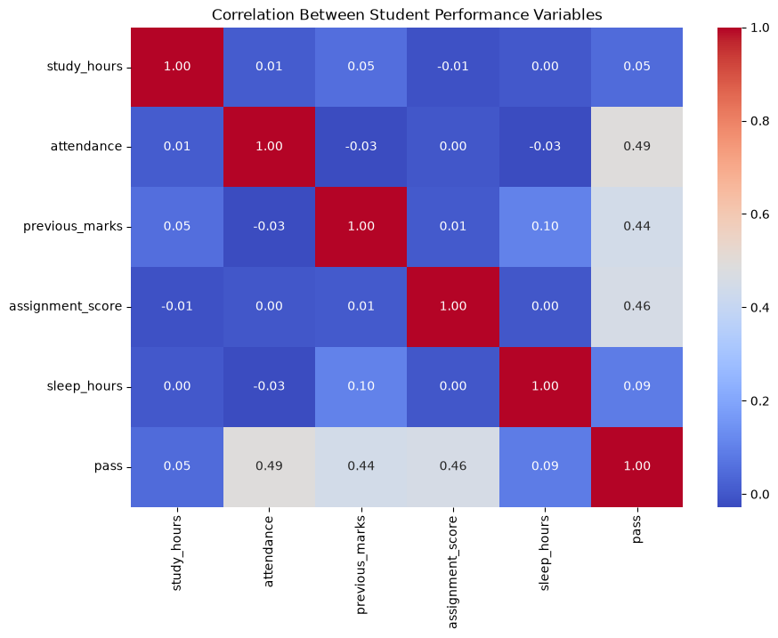
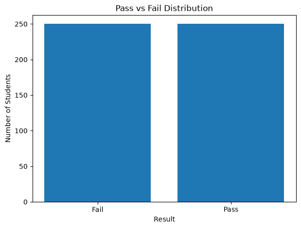
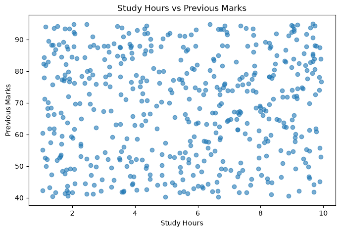

# Student Performance Predictor


A beginner-friendly machine learning project that predicts whether a student is likely to **Pass or Fail** based on academic and lifestyle-related factors.

## Live Demo

Try the deployed Streamlit application:

[**Student Performance Predictor – Live Demo**](https://student-performance-predictor-78btjjhsnc7hhfsvm3qm6t.streamlit.app/)

---

## Project Overview

The **Student Performance Predictor** is a beginner-friendly machine learning classification project developed using **Python and Scikit-learn**.

The project uses a **Logistic Regression** model to predict whether a student is likely to **Pass or Fail** based on five input features:

* **Study Hours**
* **Attendance**
* **Previous Marks**
* **Assignment Score**
* **Sleep Hours**

The prediction target is:

| Value | Meaning |
| ----- | ------- |
| `0`   | Fail    |
| `1`   | Pass    |

The trained machine learning model is integrated into a **Streamlit web application**, allowing users to enter student information and receive a predicted PASS/FAIL result together with the estimated probability of passing.

A **Flask implementation** is also included to demonstrate the development of the model as a web-based application.

---

## Features

* Student performance prediction
* Logistic Regression classification
* Synthetic student dataset generation
* Data exploration using Pandas
* Data visualization using Matplotlib and Seaborn
* Model evaluation using multiple classification metrics
* PASS/FAIL prediction
* Probability of passing
* Student input summary
* Feature correlation heatmap
* Pass vs Fail distribution chart
* Study Hours vs Previous Marks visualization
* Streamlit web interface
* Flask web interface
* Saved trained machine learning model

---

## Technologies Used

### Programming Language

* Python

### Data Science & Machine Learning

* Pandas
* NumPy
* Matplotlib
* Seaborn
* Scikit-learn
* Joblib

### Web Development

* Streamlit
* Flask
* HTML
* CSS

### Development Tools

* Visual Studio Code
* Git
* GitHub

---

## Machine Learning Workflow

The project follows a basic end-to-end machine learning workflow:

1. Generate a synthetic student dataset
2. Explore the dataset
3. Analyze the data
4. Visualize relationships between variables
5. Split the dataset into training and testing sets
6. Train a Logistic Regression model
7. Evaluate the trained model
8. Save the trained model
9. Load the model into the web application
10. Accept student information from the user
11. Generate a PASS/FAIL prediction
12. Calculate the probability of passing
13. Display the prediction and supporting information

---

## Dataset

The project uses a **synthetic dataset containing 500 student records**.

Each record contains:

* Study Hours
* Attendance
* Previous Marks
* Assignment Score
* Sleep Hours
* Pass/Fail Result

The dataset was generated programmatically for educational purposes and does **not** contain real student information.

### Dataset Distribution

The dataset contains:

* **500 student records**
* **250 Pass**
* **250 Fail**

The target labels were generated using a predefined mathematical scoring rule.

---

## Model

The project uses **Logistic Regression** for binary classification.

The model was trained using:

* **400 training records**
* **100 testing records**

### Model Evaluation

The model achieved the following results on the test set:

| Metric    |  Result |
| --------- | ------: |
| Accuracy  |  98.00% |
| Precision | 100.00% |
| Recall    |  95.74% |
| F1-Score  |  97.83% |

### Confusion Matrix

The test-set confusion matrix was:

```text
[[53  0]
 [ 2 45]]
```

This represents:

* 53 correctly predicted Fail cases
* 45 correctly predicted Pass cases
* 2 Pass cases incorrectly predicted as Fail
* 0 Fail cases incorrectly predicted as Pass

### Important Note

The dataset is synthetically generated, and the target labels are created using a mathematical scoring rule.

Therefore, the high test-set results **should not be interpreted as real-world predictive performance**.

A real student performance prediction system would require a larger, representative, appropriately collected dataset and stronger validation procedures.

---

## Data Visualizations

The project includes several visualizations to explore the generated dataset.

### Feature Correlation Heatmap

Shows the correlation between the numerical features and the target variable.



### Pass vs Fail Distribution

Shows the number of students classified as Pass and Fail.



### Study Hours vs Previous Marks

Shows the relationship between study hours and previous marks.



---

## Application Screenshots

The following screenshots demonstrate the application interface, prediction process, model information, and visualizations.

### Application Screenshot 1


### Application Screenshot 2


### Application Screenshot 3


### Application Screenshot 4


### Application Screenshot 5


### Application Screenshot 6


### Application Screenshot 7


### Application Screenshot 8


---

## Web Application

The project contains two web application implementations.

### Streamlit Application

The Streamlit application is the **current deployed version** of the project.

It provides:

* Student input fields
* Prediction button
* PASS/FAIL result
* Probability of passing
* Student information summary
* Model information
* Data visualizations

### Flask Application

The project also includes a Flask implementation with a traditional HTML/CSS web interface.

The Flask application allows users to enter student information through a web form and receive a prediction from the trained model.

---

## Project Structure

```text
Student-Performance-Predictor/
│
├── app.py
├── streamlit_app.py
│
├── data/
│   └── students.csv
│
├── models/
│   └── student_performance_model.pkl
│
├── notebooks/
│
├── screenshots/
│   ├── applicatinSs7.png
│   ├── applicationSs1.png
│   ├── applicationSs2.png
│   ├── applicationSs3.png
│   ├── applicationSs4.png
│   ├── applicationSs5.png
│   ├── applicationSs6.png
│   └── applicationSs8.png
│
├── src/
│   ├── explore_data.py
│   ├── generate_data.py
│   ├── predict_student.py
│   ├── train_model.py
│   └── visualize_data.py
│
├── static/
│   ├── correlation_heatmap.png
│   ├── pass_fail_distribution.png
│   ├── study_hours_vs_marks.png
│   └── style.css
│
├── templates/
│   └── index.html
│
├── .gitignore
├── LICENSE
├── README.md
├── Procfile
└── requirements.txt
```

---

## How to Run the Project

### 1. Clone the Repository

```bash
git clone https://github.com/Hasini-Galappaththi/Student-Performance-Predictor.git
```

### 2. Open the Project Folder

```bash
cd Student-Performance-Predictor
```

### 3. Create a Virtual Environment

```bash
python -m venv venv
```

### 4. Activate the Virtual Environment

#### Windows PowerShell

```powershell
venv\Scripts\Activate.ps1
```

#### Git Bash

```bash
source venv/Scripts/activate
```

### 5. Install the Required Packages

```bash
pip install -r requirements.txt
```

---

## Run the Streamlit Application

The Streamlit application is the current web interface used for deployment.

Run:

```bash
streamlit run streamlit_app.py
```

After running the command, open the local URL displayed in the terminal, usually:

```text
http://localhost:8501
```

---

## Run the Flask Application

To run the Flask version:

```bash
python app.py
```

Then open:

```text
http://127.0.0.1:5000
```

---

## Example Prediction

Example student input:

```text
Study Hours: 6
Attendance: 80
Previous Marks: 70
Assignment Score: 75
Sleep Hours: 7
```

The application sends these values to the trained Logistic Regression model and displays:

* Predicted performance
* Probability of passing
* Entered student information

---

## Limitations

This project is primarily an educational demonstration of a machine learning workflow.

The main limitations are:

* The dataset is synthetically generated.
* The dataset contains only 500 records.
* The target labels are generated using a predefined mathematical rule.
* The model has not been validated using real-world student data.
* The test-set results may not represent performance on real student populations.
* The current system should not be used for actual academic decision-making.

---

## Future Improvements

Possible future improvements include:

* Use a larger and representative real-world dataset
* Compare multiple machine learning algorithms
* Use cross-validation for stronger model evaluation
* Perform hyperparameter tuning
* Add more relevant student-related features
* Improve model explainability
* Add prediction history
* Add interactive data visualizations
* Improve the user interface
* Add user authentication
* Add a database for storing prediction records
* Add more advanced machine learning models

---

## Learning Outcomes

Through this project, I practiced:

* Python programming
* Data generation and preparation
* Data exploration using Pandas
* Data visualization
* Machine learning classification
* Logistic Regression
* Model evaluation
* Confusion matrices and classification metrics
* Model serialization using Joblib
* Building web interfaces for machine learning models
* Flask and Streamlit integration
* Git and GitHub
* Deploying a machine learning application

---

## Author

**Hasini Thirandi Galappaththi**

Computer Science Undergraduate
**BSc (Hons) in Computer Science**

---

## License

This project is licensed under the **MIT License**. See the [LICENSE](LICENSE) file for details.

---

## Disclaimer

This project was developed for **educational and demonstration purposes**. The dataset is synthetic, and the predictions should not be used to make real academic decisions.

